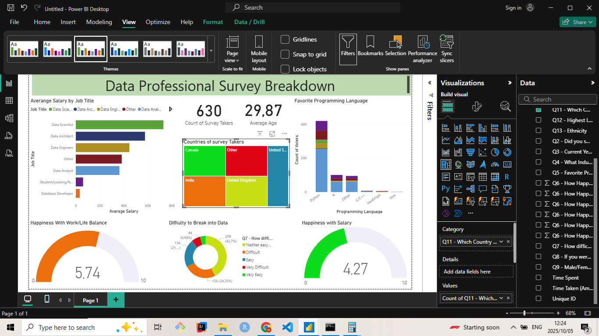
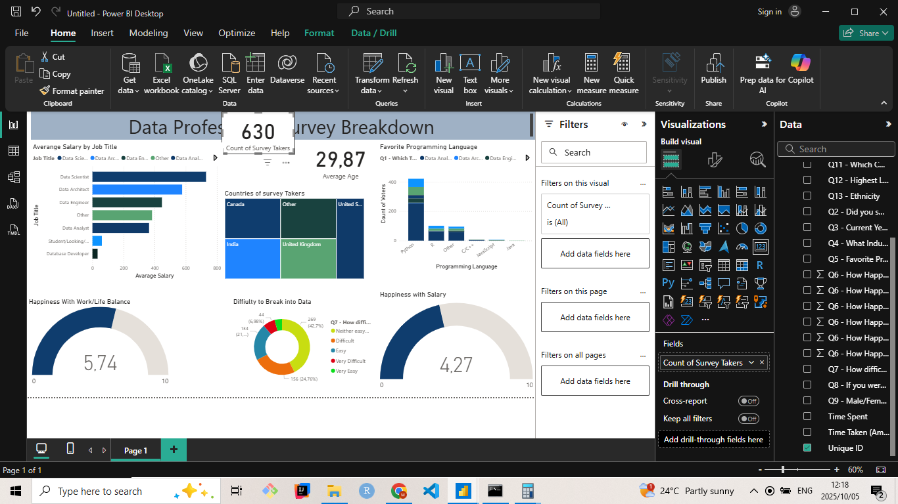

# Data Professionals Survey Power BI Dashboard

##  Project Overview

This repository contains a Power BI dashboard analyzing real survey data from over 600 data professionals. The project demonstrates the end-to-end process of data analysis:

*   **Data Transformation:** Using Power Query to clean and shape raw, messy survey data
*   **Data Modeling:** Creating calculated columns and measures (like average salary)
*   **Data Visualization:** Building an interactive dashboard with various chart types
*   **Dashboard Design:** Applying custom themes for a professional presentation

##  Key Insights Explored

The dashboard provides insights into the data community, answering questions like:

*   What is the **average salary** by job title (Data Scientist, Analyst, Engineer, etc.)?
*   What is the most popular **programming language** among data professionals?
*   How does **salary and happiness** vary by **country**?
*   What is the overall **work-life balance** and **salary satisfaction**?
*   How **difficult** was it for professionals to break into the data field?
*   What is the **gender distribution** and its correlation with salary?

##  Tools & Technologies

*   **Microsoft Power BI:** For ETL, data modeling, and visualization
*   **Power Query (M Language):** For data transformation and cleaning
*   **DAX (Data Analysis Expressions):** For creating calculated columns and measures
*   **Git & GitHub:** For version control and project hosting

##  Project Structure
data-professionals-survey-powerbi/
│
├── 📁 Data/
│ └── Power BI - Final Project.xlsx # Raw survey data
│
├── 📁 Power_BI_File/
│ └── Data Professional survey.pbix # Main Power BI report
│
├── 📁 Screenshots/
│ └── Dashboard_Final_View.png # Dashboard preview
│
└── README.md # Project documentation

text

##  Dashboard Preview

## 📸 Dashboard Preview

## 📸 Dashboard Preview

### Final Interactive Dashboard


### Clean Final View


### Work in Progress

##  How to Use This Project

1.  **Clone the Repository:**
    ```bash
    git clone https://github.com/your-username/data-professionals-survey-powerbi.git
    ```

2.  **Open in Power BI:**
    *   Navigate to the `Power_BI_File/` directory
    *   Open the `Data Professional survey.pbix` file in Power BI Desktop

3.  **Explore!** Interact with the filters and visuals to explore insights about data professionals.

##  Key Learnings & Skills Demonstrated

*   **Power Query Transformations:**
    *   Splitting columns by delimiters
    *   Replacing values and handling text fields
    *   Creating custom columns for calculations
    *   Changing data types
*   **DAX & Data Modeling:**
    *   Creating calculated columns
    *   Using aggregation functions (AVERAGE, COUNT)
*   **Data Visualization:**
    *   Utilizing various chart types: Bar/Column Charts, Treemaps, Gauges, Donut Charts, and Cards
    *   Creating interactive dashboards with cross-filtering
*   **Design & UX:**
    *   Applying and customizing Power BI themes
    *   Strategic layout for clean, professional presentation

##  Acknowledgments

*   This project uses real survey data collected from data professionals
*   Inspired by the desire to move beyond "perfect" datasets and tackle real-world, messy data

---
###  Suggestions for Further Analysis

This dataset has potential for deeper analysis:
*   Perform more advanced data cleaning (standardizing "Other" job titles and countries)
*   Create more complex DAX measures for rankings and correlations
*   Analyze relationships between salary and factors like country, job title, and programming language

**Feel free to fork this repository and build upon it!**
